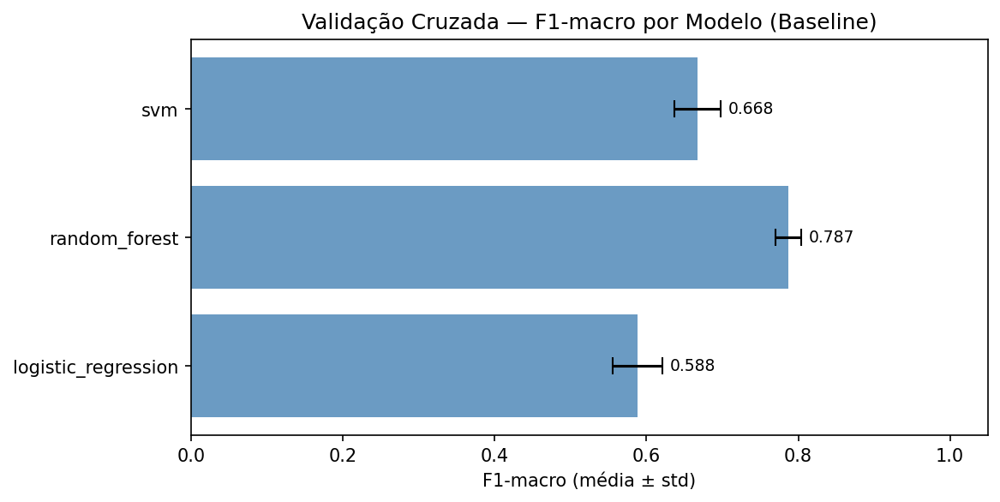
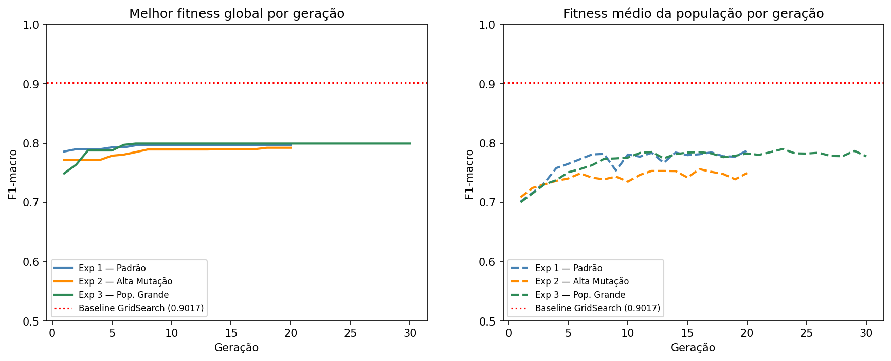
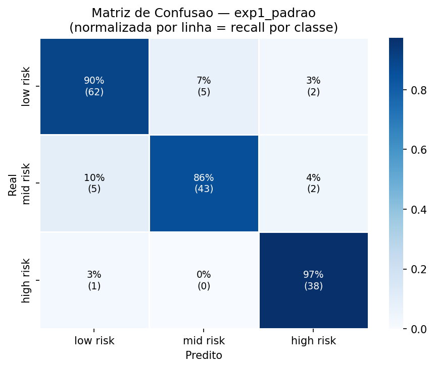
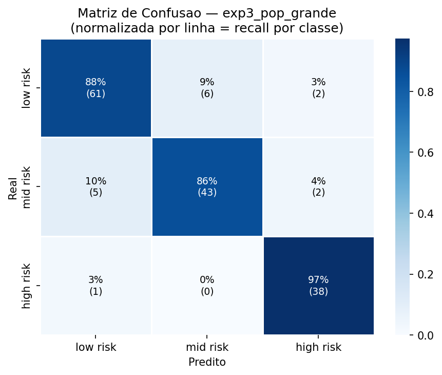

# Relatório Técnico — Tech Challenge FIAP Fase 2

| | |
|---|---|
| **Curso** | PosTech IA para Devs — FIAP |
| **Fase** | 2 — Evolução da IA: GenAI, Cloud ML e LLMs |
| **Projeto** | Projeto 1 — Otimização de Modelos de Diagnóstico |
| **Dataset** | Maternal Health Risk (UCI) — ~790 registros, 6 features clínicas |
| **Repositório** | https://github.com/igornatanael/tech-challenge-fiap-2 |
| **Vídeo** | https://youtu.be/uDdtHNXY7Io |

---

## 1. Introdução

**Problema:** classificar risco gestacional em três classes (baixo / médio / alto) a partir de sinais vitais coletados no pré-natal.

**Dataset:** Maternal Health Risk (UCI)
- ~790 registros, 6 features: `Age`, `SystolicBP`, `DiastolicBP`, `BS`, `BodyTemp`, `HeartRate`
- Leve desbalanceamento entre classes → métrica primária: **F1-macro**

**Fase 1 — resultados baseline:**

| Modelo | F1-macro | ROC-AUC | Recall Alto Risco |
|---|---|---|---|
| Regressão Logística | 0.6507 | — | — |
| SVM | 0.7090 | — | — |
| **Random Forest** | **0.9017** | **0.9813** | **0.9487** |



**Objetivos da Fase 2:**
1. Otimizar hiperparâmetros do Random Forest via **Algoritmo Genético**
2. Integrar **Claude (Anthropic API)** para gerar explicações clínicas em linguagem natural — adaptadas para médico ou paciente

---

## 2. Algoritmo Genético

### 2.1 Representação

Cada indivíduo = dicionário de 5 genes (hiperparâmetros do Random Forest):

| Gene | Tipo | Domínio |
|---|---|---|
| `n_estimators` | int | [10, 500] |
| `max_depth` | categorical | {None, 5, 10, 15, 20, 30} |
| `min_samples_split` | int | [2, 20] |
| `min_samples_leaf` | int | [1, 10] |
| `max_features` | categorical | {"sqrt", "log2", None} |

### 2.2 Operadores Genéticos

Os operadores foram escolhidos para o tipo de representação — genes independentes, sem restrição de ordem (diferente do TSP, onde operadores como OX e Swap preservam sequência):

**Seleção por torneio** (`tournament_size=3`)
- Sorteia 3 candidatos aleatórios; o com maior fitness vira pai
- Mantém diversidade: indivíduos medianos ainda têm chance de se reproduzir

**Cruzamento uniforme** (`crossover_rate`)
- Cada gene do filho é herdado de um dos pais com probabilidade 0.5
- Gera combinações inéditas sem viés posicional

**Mutação por gene** (`mutation_rate`)
- Com probabilidade `mutation_rate` por gene: int → novo valor nos bounds; categorical → nova opção aleatória
- Permite explorar regiões fora da população inicial

**Elitismo:** o melhor indivíduo global é preservado em todas as gerações.

### 2.3 Função Fitness

```
fitness = média F1-macro em StratifiedKFold(n_splits=5)
```

F1-macro escolhido por duas razões:
- Problema multiclasse com classes desbalanceadas → macro trata todas igualmente
- Equilibra precisão e recall especialmente para a classe de alto risco

---

## 3. Experimentos

### 3.1 Configurações

| Parâmetro | Exp 1 — Padrão | Exp 2 — Alta Mutação | Exp 3 — Pop. Grande |
|---|---|---|---|
| `population_size` | 30 | 30 | 60 |
| `generations` | 20 | 20 | 30 |
| `mutation_rate` | 0.10 | 0.30 | 0.10 |
| `crossover_rate` | 0.80 | 0.80 | 0.90 |
| `random_state` | 42 | 43 | 44 |
| Tempo (s) | 450 | 667 | 1045 |

### 3.2 Convergência



- Todos os experimentos superam o baseline nas primeiras gerações
- Exp 2 (alta mutação) convergiu mais devagar — perturbação excessiva diluiu a pressão seletiva
- Exp 1 atingiu platô por volta da geração 7–10

### 3.3 Resultados no Conjunto de Teste

| Modelo | F1-macro | ROC-AUC | Recall Alto Risco | Accuracy |
|---|---|---|---|---|
| Baseline (GridSearch) | 0.9017 | 0.9813 | 0.9487 | 0.8987 |
| **AG Exp 1 — Padrão** | **0.9070** | 0.9811 | **0.9744** | **0.9051** |
| AG Exp 2 — Alta Mutação | 0.9017 | 0.9813 | 0.9487 | 0.8987 |
| AG Exp 3 — Pop. Grande | 0.9013 | 0.9812 | 0.9744 | 0.8987 |

**Exp 1 é o único que melhorou em todas as métricas simultaneamente.**

**Melhores hiperparâmetros encontrados:**

| Hiperparâmetro | Baseline | Exp 1 | Exp 2 | Exp 3 |
|---|---|---|---|---|
| `n_estimators` | 100 | **73** | 91 | 69 |
| `max_depth` | None | **15** | 20 | 15 |
| `min_samples_split` | 2 | 2 | 2 | 2 |
| `min_samples_leaf` | 1 | 1 | 1 | 1 |
| `max_features` | sqrt | sqrt | log2 | log2 |

**Matrizes de confusão — modelos otimizados:**





### 3.4 Análise

- **Recall alto risco 0.9487 → 0.9744 (Exp 1):** em 39 casos de alto risco no teste, o baseline errava ~2; o AG erra ~1. Cada erro nessa classe tem consequência clínica direta.
- **`max_depth=15` vs `None`:** o AG convergiu consistentemente para árvores mais rasas. A validação cruzada estratificada penalizou overfitting de forma mais eficaz que a grade estática do GridSearch.
- **`n_estimators` menor (73 vs 100):** para ~790 registros, um ensemble mais enxuto captura a estrutura preditiva sem custo adicional.
- **Exp 2 (mut=0.30):** encontrou os mesmos hiperparâmetros do baseline — perturbação alta demais para convergir em 20 gerações.
- **Exp 3 (pop=60, gen=30):** recall equivalente ao Exp 1, mas ao custo de 1045s vs 450s → retorno decrescente para este dataset.

---

## 4. Integração com LLM (Claude)

### 4.1 Arquitetura

```
BaseAgent (histórico multi-turn, logging, Anthropic SDK)
├── PatientAgent  → linguagem acessível, guardrails anti-prescrição
└── DoctorAgent   → terminologia clínica, resposta em 4 seções
```

- Modelo: `claude-sonnet-4-6`
- Histórico preservado por sessão → perguntas de follow-up têm contexto completo
- Cada chamada loga `input_tokens`, `output_tokens` e `elapsed_ms`

### 4.2 Diferenças entre Agentes

| | PatientAgent | DoctorAgent |
|---|---|---|
| Tom | Acolhedor, sem jargão | Técnico, terminologia clínica |
| Probabilidades | Não cita números | Inclui probabilidades e feature importance |
| Estrutura | Orientações práticas | 4 seções: análise · avaliação · investigação · conduta |
| Guardrails | Não prescreve, não extrapola escopo | Não responde questões administrativas/jurídicas |
| Referências clínicas | Não | PA ≥140/90 = HAS; BS ≥7.0 = diabetes; etc. |

### 4.3 Prompt Engineering

O prompt inicial de cada agente injeta:
- Dados clínicos individuais da paciente
- Predição do modelo + probabilidades por classe
- Importância das top 4 features

→ Respostas são personalizadas por caso, não genéricas por classe de risco.

### 4.4 Avaliação — LLM-as-judge

O `evaluator.py` usa o próprio Claude para avaliar a qualidade das respostas:

| Critério (PatientAgent) | Critério (DoctorAgent) |
|---|---|
| clareza (1–5) | precisao_clinica (1–5) |
| tom_adequado (1–5) | completude (1–5) |
| urgencia_correta (1–5) | acionabilidade (1–5) |
| acionabilidade (1–5) | terminologia (1–5) |
| within_scope (bool) | within_scope (bool) |

Retorna `{scores, within_scope, justificativa, score_total}` em JSON estruturado.

### 4.5 Interface Web — Chatbot

Fluxo da aplicação Streamlit (`app.py`):

```
Landing page
    → Identificação: médico ou paciente?
    → Coleta dos 6 campos via chat (com validação fisiológica)
    → Predição RF + geração da análise inicial pelo agente
    → Q&A multi-turn com histórico preservado
```

- Temperatura coletada em °C, convertida para °F antes do modelo
- Cross-validação: diastólica < sistólica
- Palavra-chave "recomeçar" reinicia a sessão

---

## 5. Observabilidade

Logging estruturado em JSON (NDJSON) — plugável para cloud sem alterar código de negócio:

```python
# Para adicionar cloud basta um handler em setup_logging():
logger.addHandler(watchtower.CloudWatchLogHandler(...))   # AWS
logger.addHandler(DatadogHandler(...))                     # Datadog
```

**Eventos por sessão** (todos correlacionados por `session_id`):

| Evento | Dados logados |
|---|---|
| `session.started` | role (patient/doctor) |
| `data.collected` | campos coletados (sem valores clínicos) |
| `model.prediction` | risk_level, probabilidades |
| `llm.call.started` | agent_type, model, turn |
| `llm.call.completed` | input_tokens, output_tokens, elapsed_ms |
| `qa.question` | número do turn |

> Valores clínicos individuais não são logados — apenas resultado agregado.

---

## 6. Desafios e Soluções

| Desafio | Solução |
|---|---|
| `matplotlib.Path.__deepcopy__` causa recursão infinita no Python 3.14 | Patch manual do método no venv; remoção de `plt.tight_layout()` |
| `n_jobs=-1` falha na serialização com joblib no Python 3.14 | Substituição por `n_jobs=1` em `baseline.py` e `fitness.py` |
| scipy sem wheel para Python 3.14 | Remoção do scipy — funcionalidades cobertas pelo scikit-learn |
| dtype `object` em `y_train` após `map()` | `.astype("int64")` explícito após o split |
| AG lento sem paralelismo (~35 min para 3 experimentos) | Desenvolvimento com pop=5/gen=3; execução completa headless via `nbconvert` |

---

## 7. Testes Automatizados

21 testes em 4 módulos — todos passando:

| Módulo | Arquivo | O que testa |
|---|---|---|
| encoding | `test_encoding.py` | Keys, bounds int/float, choices categorical, decode para sklearn |
| operators | `test_operators.py` | Torneio, cruzamento, mutação, bounds respeitados |
| ga | `test_ga.py` | Keys do resultado, comprimento do histórico, monotonicidade do `global_best`, reprodutibilidade |
| prompts | `test_prompts.py` | Presença de predição, dados do paciente e métricas nos prompts |

---

## 8. Conclusão

O AG superou o GridSearch na métrica clinicamente mais relevante: **recall de alto risco 0.9487 → 0.9744**, com ganhos adicionais em F1-macro e accuracy. A convergência para `max_depth=15` (vs `None` no GridSearch) e `n_estimators` menores indica que a validação cruzada estratificada como fitness penaliza overfitting de forma mais eficaz que uma grade estática.

A arquitetura de agentes LLM permite que o mesmo classificador produza saídas radicalmente diferentes por perfil de usuário — orientações práticas acessíveis para a paciente, análise clínica estruturada para o médico — com histórico de conversa preservado para Q&A contextualizado.

**Limitações:**
- Dataset pequeno (~790 registros) — diferenças de 0.005 em F1-macro podem não ser estatisticamente robustas
- Critério de parada fixo (gerações) — o Exp 1 estabiliza por volta da geração 7–10
- Respostas dos agentes LLM não foram validadas por obstetras em estudo controlado
